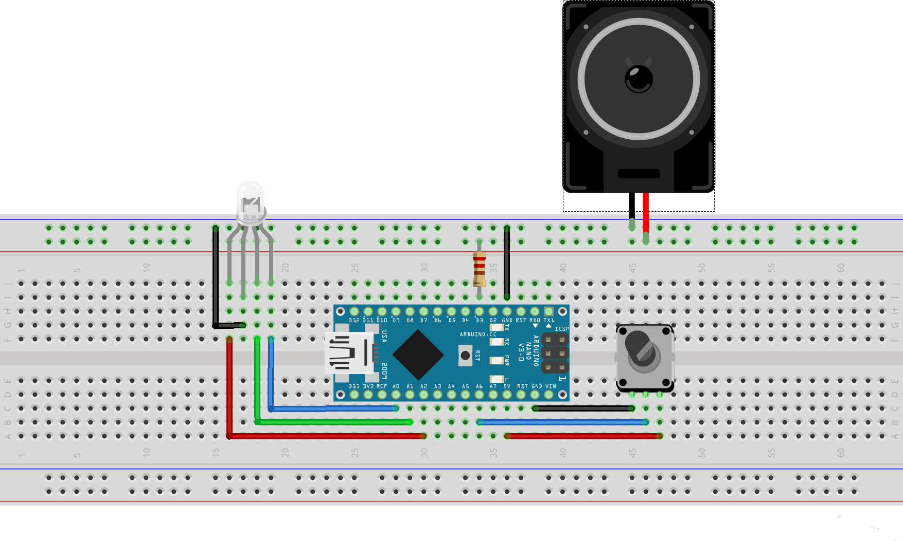

# iPoduino
iPoduino is a music player that plays three songs/pieces:
    Frédéric Chopin's "Nocturne in E-flat Major, Opus 9 Number 2" (1830-1832)
    Keyboard Cat's Iconic Keyboard Solo (2007)
    Vanessa Carlton's "A Thousand Miles" (2002)

